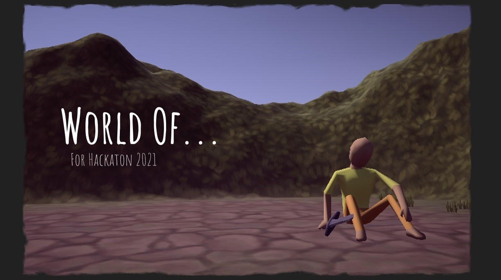
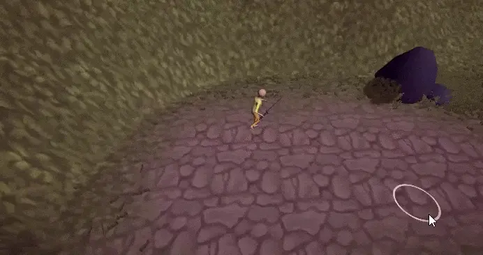
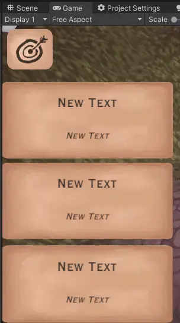
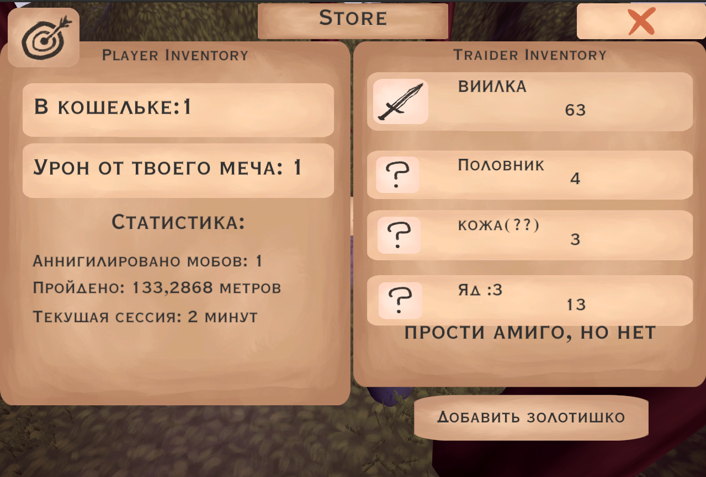
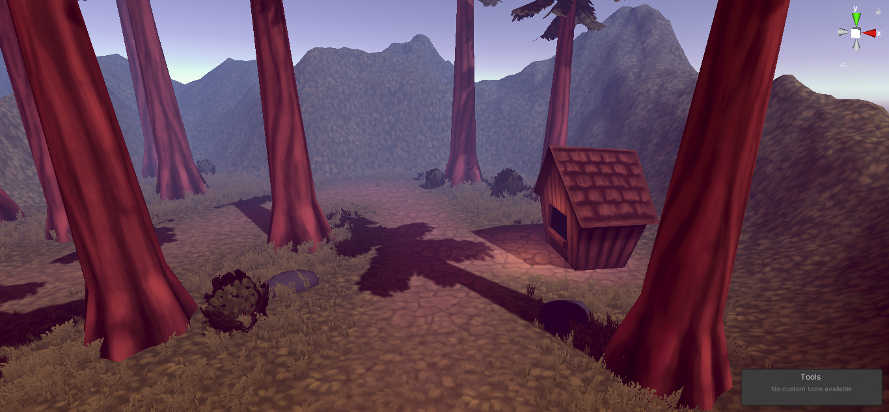
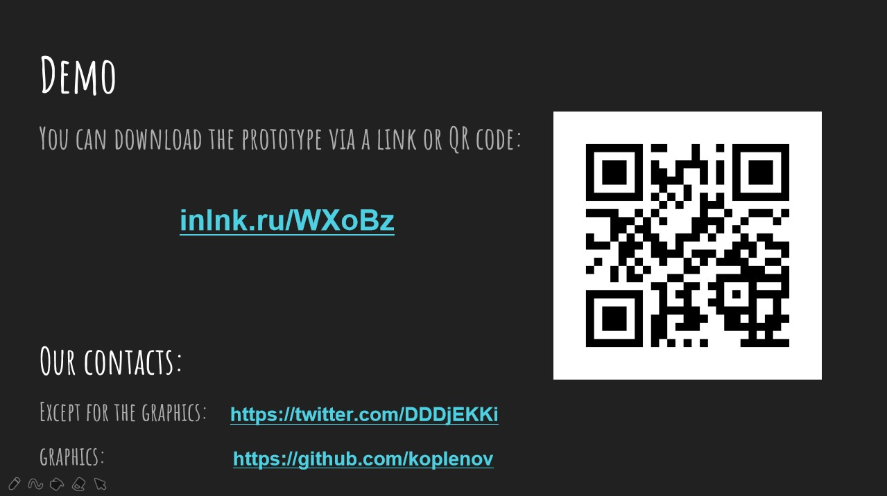

[Хакатон](http://fantastic-hackathon2021.ru/), 48 hours

The [task](https://vk.com/doc101851796_592155614) sounded like this:

```
Implement any game.
The main condition:
The gameplay of the game must be such that the
player, with a small game session,
a desire to watch
5 commercials
```

<details>
  <summary>My opinion of case</summary>

These guys were *exclusively* interested in the material side of the project. They didn't care about the idea, the implementation, the optimization - only money.

As I found out later, this is (at least) the second year they have handed out this case at the hackathon. No creativity 

Guys at [FullHP](http://fullhpltd.com/), I used to want to come to you for an internship, but... no thanks

¯\\_(ツ)_/¯ 

</details>

[Presentation](overview/World-Of....pptx) and [another](overview/Hackaton-2021-text.pptx)

|  |
| :------------------- |


| *Core gameplay:* |
| :------------------- |
|  |


The key cor mechanics of our game are killing enemies, which rewards the player with a certain amount of currency/experience, as well as trading with the local merchant. 


*Retention mechanics* |  
------------ | -------------:

To get players back into the game, we decided to implement some retention mechanics. One of these is daily tasks. Each day, when entering the game, the player is given three small tasks, for the completion of which he receives a small reward. When all three are completed, a more significant reward is given. The second retention mechanic we decided to make events - random events that cause the player to extend the session additionally. Some examples of events are robberies of the player or raising prices at the merchant.

*When the ads?* |  
------------ | -------------


| *Little about graphics:* |
| :------------------- |
|  |
|This is what the game could look like.... |


|  |
| :------------------- |

[Graphics creator](https://twitter.com/DDDjEKKi)

[Code man](https://github.com/koplenov)

